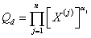
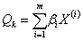

Опубликовано:

*Тушавин В. А. Развитие квалиметрии услуг на основе метода стохастического доминирования // Вопросы радиоэлектроники*


**Аннотация:** *В статье рассматриваются проблема оценки качества услуг в условиях неопределенности. Рассматриваются основные походы к построению функции свертки комплексного показателя качества услуг. Обосновывается преимущества применения метода стохастического доминирования в сравнении с традиционными походамию*

### Загрузка данных

Данные выгружены из учетной системы в текстовый файл, с разделителем табуляцией и десятичной точкой (,).

```{r}
mydata<-read.table("datafile.csv",header=T,dec=",")
dim(mydata)
head(mydata)
summary(mydata)
```

### Функции, которые будут использоваться для анализа

Преобразование шкал с учетом потери качества
```{r}
convert.scale<-function(bad,good,val) {
  x1=bad
  x2=good
  x3=2*good-bad
  y1=0
  y2=1
  y3=0
  a<-(y3-(x3*(y2-y1)+x2*y1-x1*y2)/(x2-x1))/(x3*(x3-x1-x2)+x1*x2)
  b<-(y2-y1)/(x2-x1)-a*(x1+x2)
  c<-(x2*y1-x1*y2)/(x2-x1)+a*x1*x2
  y=a*val*val+b*val+c
  return(ifelse(y>0,y,0))
}

```

Опишем функции вида
; ; 
для данной задачи

```{r}
qf.1<-function(mtx2,mtx3,value) {
Q.D<-(value[1]^mtx3[,1])*(value[2]^mtx3[,2])*(value[5]^mtx3[,3])
Q.K<-value[3]*mtx2[,1]+value[4]*mtx2[,2]
return(Q.D*Q.K)
}

```

Вторая формула

```{r}
qf.2<-function(mtx2,mtx3,value) {
  Q.D<-value[1]^(1/3)*value[2]^(1/3)*value[5]^(1/3)*(value[1]+1)^mtx3[,1]*(value[2]+1)^mtx3[,2]*(value[5]+1)^mtx3[,3]/2
  Q.K<-(value[3]+1)^mtx2[,1]*(value[4]+1)*mtx2[,2]-1
  Q=Q.D*(1+Q.K)/2
  return(Q)
  }

```


### Преобразование данных

Создаем новую таблицу для анализа. Определяем дату отчета на основании номера недели в году.


```{r}
td<-data.frame(YM=as.Date(mydata$Week*7,origin=paste(mydata$Year,"01","01",sep="-")))

```

Первый показатель $Q_1$ находим как долю обращений выполненных вовремя: идеальный показатель 1, минимально допустимый 0.8.


```{r}
td$Q1<-convert.scale(0.8,1,1-mydata$Bad/mydata$Total)
```

Второй показатель качества $Q_2$ находим как долю обращений без жалоб к общему числу обращений.
Идеальный показатель 1, минимально допустимый 0.99

```{r}
td$Q2<-convert.scale(0.99,1,1-mydata$Claim/mydata$Total)
```

Третий показатель качества $Q_3$ считаем как отклонение от максимально допустимого времени 7200 секунд (2 часа).  Идеальный показатель 7200, минимально допустимый 0.

```{r}
td$Q3<-convert.scale(0,7200,7200-mydata$Reg_time)
```

Четвертый показатель качества $Q_4$ считаем как отклонение от максимально допустимого времени в два дня 57600 секунд (16 часов).  Идеальный показатель 57600, минимально допустимый 0.

```{r}
td$Q4<-convert.scale(0,57600,57600-mydata$Work_time)
```

Пятый показатель качества $Q_5$ --- средняя оценка. Идеальный 5, минимально допустимый 3.

```{r}
td$Q5<-convert.scale(3,5,mydata$Rate)
```
Результаты обработки данных

```{r pic1,warning=FALSE}
head(td)
summary(td)
plot(td$YM,td$Q1,xlab="Период",ylab="Показатель", type="l",main="Динамика показателей качества",ylim=c(0,1))
lines(td$YM,td$Q2,col="red")
lines(td$YM,td$Q3,col="green")
lines(td$YM,td$Q4,col="blue")
lines(td$YM,td$Q5,col="violet")
```


Рассчитаем целевые показатели 
```{r}
target<-c(convert.scale(0.8,1,0.95),
        convert.scale(0.99,1,0.995),
        convert.scale(0,7200,7200-5500),
        convert.scale(0,57600,57600-30000),
        convert.scale(3,5,3.4))
minimum<-c(convert.scale(0.8,1,0.91),
        convert.scale(0.99,1,0.99),
        convert.scale(0,7200,7200-7000),
        convert.scale(0,57600,57600-50000),
        convert.scale(3,5,3.2))

```
Для расчетов понадобятся матрицы случайных весов

В данном случае, поскольку третий и четвертый показатель связаны с внутренними нормативами, не всегда учитывающими специфику инженерного труда, то их надлежит рассматривать как компенсирующие показатели, в то время как остальные непосредственно связаны с потребителем услуг и должны рассматриваться как доминирующие. Также предположим отсутствие преимуществ у отдельных показателей внутри групп.

```{r genmatrix}
library(gtools)
set.seed(2015)
mtx2<-rdirichlet(1000,rep(1,2))
mtx3<-rdirichlet(1000,rep(1,3))

```


```{r try01}
td$minimum1<-NA
td$target1<-NA
for(i in 1:nrow(td)) {
td$target1[i]<- sum(qf.1(mtx2,mtx3,as.vector(td[i,2:6],"double")) > qf.1(mtx2,mtx3,target))/1000
td$minimum1[i]<-sum(qf.1(mtx2,mtx3,as.vector(td[i,2:6],"double")) > qf.1(mtx2,mtx3,minimum))/1000
}
summary(td[,7:8])
```

Найдем число показателей, превысивших уровень 0.6

```{r pic2,warning=FALSE}
sum(td$minimum1>0.6)
sum(td$target1>0.6)
hist(td$target1,breaks=25,xlab="Вероятность доминирования",ylab="Количество",main="Гистограмма распределения\n вероятностей стохастического доминирования")
```


Проверим на доминирование каждый из показателей для каждого периода и рассчитаем вероятности для второй свертки


```{r}
td$minimum2<-NA
td$target2<-NA
for(i in 1:nrow(td)) {
td$target2[i]<- sum(qf.2(mtx2,mtx3,as.vector(td[i,2:6],"double")) > qf.2(mtx2,mtx3,target))/1000
td$minimum2[i]<-sum(qf.2(mtx2,mtx3,as.vector(td[i,2:6],"double")) > qf.2(mtx2,mtx3,minimum))/1000
}
summary(td[,9:10])
```

Найдем число показателей, превысивших уровень 0.6

```{r pic3,warning=FALSE}
sum(td$minimum2>0.6)
sum(td$target2>0.6)
hist(td$target2,breaks=25,xlab="Вероятность доминирования",ylab="Количество",main="Гистограмма распределения\n вероятностей стохастического доминирования")
```
Совпадение оценок

```{r}
library(caret)
confusionMatrix(td$minimum1>0.6,td$minimum2>0.6)
confusionMatrix(td$target1>0.6,td$target2>0.6)
```

Информация о параметрах R

```{r}
sessionInfo()
```


