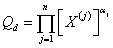
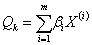
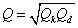
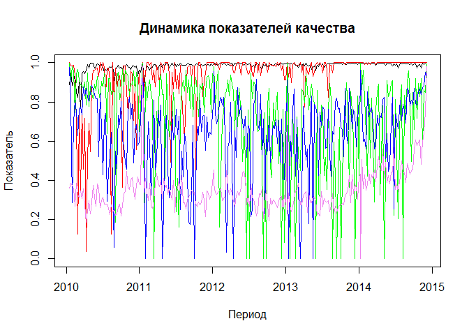
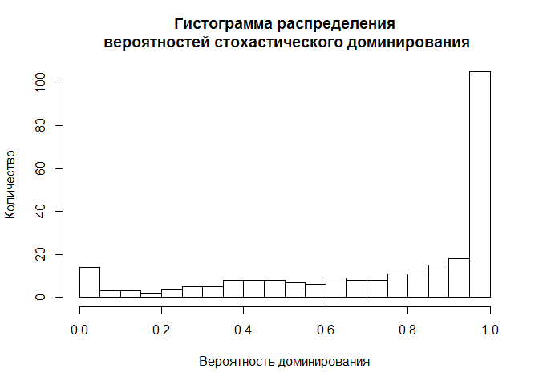
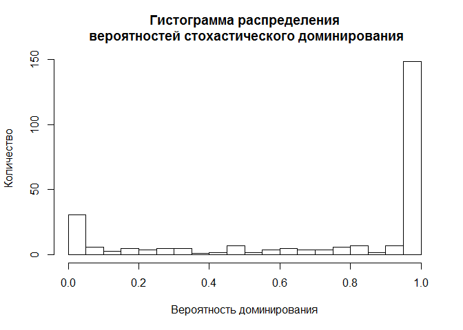

# Развитие квалиметрии услуг на основе метода стохастического доминирования
Тушавин В. А.  
Friday, November 14, 2014  
Опубликовано:

*Тушавин В. А. Развитие квалиметрии услуг на основе метода стохастического доминирования // Вопросы радиоэлектроники*


**Аннотация:** *В статье рассматриваются проблема оценки качества услуг в условиях неопределенности. Рассматриваются основные походы к построению функции свертки комплексного показателя качества услуг. Обосновывается преимущества применения метода стохастического доминирования в сравнении с традиционными походамию*

### Загрузка данных

Данные выгружены из учетной системы в текстовый файл, с разделителем табуляцией и десятичной точкой (,).


```r
mydata<-read.table("datafile.csv",header=T,dec=",")
dim(mydata)
```

```
## [1] 258   8
```

```r
head(mydata)
```

```
##   Year Week Total Bad Reg_time Work_time Claim     Rate
## 1 2010    2    15   1      257      8921     0 3.400000
## 2 2010    3   763  35     2135     25489     1 3.432624
## 3 2010    4   769  52     1003     48695     1 3.416667
## 4 2010    5   845  51     1459     31742     1 3.394822
## 5 2010    6   791  39     3628     25259     2 3.290323
## 6 2010    7   733  58     1718     28581     4 3.432727
```

```r
summary(mydata)
```

```
##       Year           Week           Total             Bad       
##  Min.   :2010   Min.   : 1.00   Min.   :   1.0   Min.   : 0.00  
##  1st Qu.:2011   1st Qu.:14.00   1st Qu.: 752.0   1st Qu.:11.00  
##  Median :2012   Median :27.00   Median : 854.0   Median :17.00  
##  Mean   :2012   Mean   :26.74   Mean   : 826.5   Mean   :17.59  
##  3rd Qu.:2013   3rd Qu.:39.75   3rd Qu.: 946.8   3rd Qu.:22.00  
##  Max.   :2014   Max.   :53.00   Max.   :1330.0   Max.   :72.00  
##     Reg_time       Work_time         Claim            Rate      
##  Min.   :  101   Min.   : 8921   Min.   :0.000   Min.   :3.000  
##  1st Qu.: 2358   1st Qu.:26611   1st Qu.:0.000   1st Qu.:3.306  
##  Median : 3076   Median :31834   Median :1.000   Median :3.366  
##  Mean   : 3536   Mean   :33281   Mean   :1.221   Mean   :3.396  
##  3rd Qu.: 4332   3rd Qu.:38462   3rd Qu.:2.000   3rd Qu.:3.432  
##  Max.   :10644   Max.   :89287   Max.   :8.000   Max.   :4.750
```

### Функции, которые будут использоваться для анализа

Преобразование шкал с учетом потери качества

```r
convert.scale<-function(bad,good,val) {
  x1=bad
  x2=good
  x3=2*good-bad
  y1=0
  y2=1
  y3=0
  a<-(y3-(x3*(y2-y1)+x2*y1-x1*y2)/(x2-x1))/(x3*(x3-x1-x2)+x1*x2)
  b<-(y2-y1)/(x2-x1)-a*(x1+x2)
  c<-(x2*y1-x1*y2)/(x2-x1)+a*x1*x2
  y=a*val*val+b*val+c
  return(ifelse(y>0,y,0))
}
```

Опишем функции вида
; ; 
для данной задачи


```r
qf.1<-function(mtx2,mtx3,value) {
Q.D<-(value[1]^mtx3[,1])*(value[2]^mtx3[,2])*(value[5]^mtx3[,3])
Q.K<-value[3]*mtx2[,1]+value[4]*mtx2[,2]
return(Q.D*Q.K)
}
```

Вторая формула


```r
qf.2<-function(mtx2,mtx3,value) {
  Q.D<-value[1]^(1/3)*value[2]^(1/3)*value[5]^(1/3)*(value[1]+1)^mtx3[,1]*(value[2]+1)^mtx3[,2]*(value[5]+1)^mtx3[,3]/2
  Q.K<-(value[3]+1)^mtx2[,1]*(value[4]+1)*mtx2[,2]-1
  Q=Q.D*(1+Q.K)/2
  return(Q)
  }
```


### Преобразование данных

Создаем новую таблицу для анализа. Определяем дату отчета на основании номера недели в году.


```r
td<-data.frame(YM=as.Date(mydata$Week*7,origin=paste(mydata$Year,"01","01",sep="-")))
```

Первый показатель $Q_1$ находим как долю обращений выполненных вовремя: идеальный показатель 1, минимально допустимый 0.8.


```r
td$Q1<-convert.scale(0.8,1,1-mydata$Bad/mydata$Total)
```

Второй показатель качества $Q_2$ находим как долю обращений без жалоб к общему числу обращений.
Идеальный показатель 1, минимально допустимый 0.99


```r
td$Q2<-convert.scale(0.99,1,1-mydata$Claim/mydata$Total)
```

Третий показатель качества $Q_3$ считаем как отклонение от максимально допустимого времени 7200 секунд (2 часа).  Идеальный показатель 7200, минимально допустимый 0.


```r
td$Q3<-convert.scale(0,7200,7200-mydata$Reg_time)
```

Четвертый показатель качества $Q_4$ считаем как отклонение от максимально допустимого времени в два дня 57600 секунд (16 часов).  Идеальный показатель 57600, минимально допустимый 0.


```r
td$Q4<-convert.scale(0,57600,57600-mydata$Work_time)
```

Пятый показатель качества $Q_5$ --- средняя оценка. Идеальный 5, минимально допустимый 3.


```r
td$Q5<-convert.scale(3,5,mydata$Rate)
```
Результаты обработки данных


```r
head(td)
```

```
##           YM        Q1        Q2        Q3        Q4        Q5
## 1 2010-01-15 0.8888889 1.0000000 0.9987259 0.9760127 0.3600000
## 2 2010-01-22 0.9473950 0.9828229 0.9120713 0.8041784 0.3858332
## 3 2010-01-29 0.8856874 0.9830899 0.9805940 0.2853000 0.3732639
## 4 2010-02-05 0.9089318 0.9859949 0.9589375 0.6963148 0.3558509
## 5 2010-02-12 0.9392262 0.9360697 0.7460960 0.8076964 0.2692508
## 6 2010-02-19 0.8434734 0.7022087 0.9430647 0.7537876 0.3859140
```

```r
summary(td)
```

```
##        YM                   Q1               Q2                Q3        
##  Min.   :2010-01-15   Min.   :0.7665   Min.   :0.03647   Min.   :0.0000  
##  1st Qu.:2011-04-10   1st Qu.:0.9829   1st Qu.:0.94749   1st Qu.:0.6381  
##  Median :2012-06-27   Median :0.9903   Median :0.98926   Median :0.8175  
##  Mean   :2012-06-26   Mean   :0.9835   Mean   :0.93639   Mean   :0.7171  
##  3rd Qu.:2013-09-15   3rd Qu.:0.9956   3rd Qu.:1.00000   3rd Qu.:0.8927  
##  Max.   :2014-12-03   Max.   :1.0000   Max.   :1.00000   Max.   :0.9998  
##        Q4               Q5        
##  Min.   :0.0000   Min.   :0.0000  
##  1st Qu.:0.5541   1st Qu.:0.2828  
##  Median :0.6946   Median :0.3325  
##  Mean   :0.6432   Mean   :0.3494  
##  3rd Qu.:0.7866   3rd Qu.:0.3856  
##  Max.   :0.9760   Max.   :0.9844
```

```r
plot(td$YM,td$Q1,xlab="Период",ylab="Показатель", type="l",main="Динамика показателей качества",ylim=c(0,1))
lines(td$YM,td$Q2,col="red")
lines(td$YM,td$Q3,col="green")
lines(td$YM,td$Q4,col="blue")
lines(td$YM,td$Q5,col="violet")
```

 


Рассчитаем целевые показатели 

```r
target<-c(convert.scale(0.8,1,0.95),
        convert.scale(0.99,1,0.995),
        convert.scale(0,7200,7200-5500),
        convert.scale(0,57600,57600-30000),
        convert.scale(3,5,3.4))
minimum<-c(convert.scale(0.8,1,0.91),
        convert.scale(0.99,1,0.99),
        convert.scale(0,7200,7200-7000),
        convert.scale(0,57600,57600-50000),
        convert.scale(3,5,3.2))
```
Для расчетов понадобятся матрицы случайных весов

В данном случае, поскольку третий и четвертый показатель связаны с внутренними нормативами, не всегда учитывающими специфику инженерного труда, то их надлежит рассматривать как компенсирующие показатели, в то время как остальные непосредственно связаны с потребителем услуг и должны рассматриваться как доминирующие. Также предположим отсутствие преимуществ у отдельных показателей внутри групп.


```r
library(gtools)
set.seed(2015)
mtx2<-rdirichlet(1000,rep(1,2))
mtx3<-rdirichlet(1000,rep(1,3))
```


```r
td$minimum1<-NA
td$target1<-NA
for(i in 1:nrow(td)) {
td$target1[i]<- sum(qf.1(mtx2,mtx3,as.vector(td[i,2:6],"double")) > qf.1(mtx2,mtx3,target))/1000
td$minimum1[i]<-sum(qf.1(mtx2,mtx3,as.vector(td[i,2:6],"double")) > qf.1(mtx2,mtx3,minimum))/1000
}
summary(td[,7:8])
```

```
##     minimum1         target1      
##  Min.   :0.0000   Min.   :0.0000  
##  1st Qu.:1.0000   1st Qu.:0.5420  
##  Median :1.0000   Median :0.8815  
##  Mean   :0.9961   Mean   :0.7395  
##  3rd Qu.:1.0000   3rd Qu.:0.9990  
##  Max.   :1.0000   Max.   :1.0000
```

Найдем число показателей, превысивших уровень 0.6


```r
sum(td$minimum1>0.6)
```

```
## [1] 257
```

```r
sum(td$target1>0.6)
```

```
## [1] 185
```

```r
hist(td$target1,breaks=25,xlab="Вероятность доминирования",ylab="Количество",main="Гистограмма распределения\n вероятностей стохастического доминирования")
```

 


Проверим на доминирование каждый из показателей для каждого периода и рассчитаем вероятности для второй свертки


```r
td$minimum2<-NA
td$target2<-NA
for(i in 1:nrow(td)) {
td$target2[i]<- sum(qf.2(mtx2,mtx3,as.vector(td[i,2:6],"double")) > qf.2(mtx2,mtx3,target))/1000
td$minimum2[i]<-sum(qf.2(mtx2,mtx3,as.vector(td[i,2:6],"double")) > qf.2(mtx2,mtx3,minimum))/1000
}
summary(td[,9:10])
```

```
##     minimum2         target2      
##  Min.   :0.0000   Min.   :0.0000  
##  1st Qu.:1.0000   1st Qu.:0.4818  
##  Median :1.0000   Median :0.9965  
##  Mean   :0.9961   Mean   :0.7313  
##  3rd Qu.:1.0000   3rd Qu.:1.0000  
##  Max.   :1.0000   Max.   :1.0000
```

Найдем число показателей, превысивших уровень 0.6


```r
sum(td$minimum2>0.6)
```

```
## [1] 257
```

```r
sum(td$target2>0.6)
```

```
## [1] 183
```

```r
hist(td$target2,breaks=25,xlab="Вероятность доминирования",ylab="Количество",main="Гистограмма распределения\n вероятностей стохастического доминирования")
```

 
Совпадение оценок


```r
library(caret)
```

```
## Loading required package: lattice
## Loading required package: ggplot2
```

```r
confusionMatrix(td$minimum1>0.6,td$minimum2>0.6)
```

```
## Confusion Matrix and Statistics
## 
##           Reference
## Prediction FALSE TRUE
##      FALSE     1    0
##      TRUE      0  257
##                                      
##                Accuracy : 1          
##                  95% CI : (0.9858, 1)
##     No Information Rate : 0.9961     
##     P-Value [Acc > NIR] : 0.3672     
##                                      
##                   Kappa : 1          
##  Mcnemar's Test P-Value : NA         
##                                      
##             Sensitivity : 1.000000   
##             Specificity : 1.000000   
##          Pos Pred Value : 1.000000   
##          Neg Pred Value : 1.000000   
##              Prevalence : 0.003876   
##          Detection Rate : 0.003876   
##    Detection Prevalence : 0.003876   
##       Balanced Accuracy : 1.000000   
##                                      
##        'Positive' Class : FALSE      
## 
```

```r
confusionMatrix(td$target1>0.6,td$target2>0.6)
```

```
## Confusion Matrix and Statistics
## 
##           Reference
## Prediction FALSE TRUE
##      FALSE    59   14
##      TRUE     16  169
##                                           
##                Accuracy : 0.8837          
##                  95% CI : (0.8382, 0.9202)
##     No Information Rate : 0.7093          
##     P-Value [Acc > NIR] : 1.659e-11       
##                                           
##                   Kappa : 0.7158          
##  Mcnemar's Test P-Value : 0.8551          
##                                           
##             Sensitivity : 0.7867          
##             Specificity : 0.9235          
##          Pos Pred Value : 0.8082          
##          Neg Pred Value : 0.9135          
##              Prevalence : 0.2907          
##          Detection Rate : 0.2287          
##    Detection Prevalence : 0.2829          
##       Balanced Accuracy : 0.8551          
##                                           
##        'Positive' Class : FALSE           
## 
```

Информация о параметрах R


```r
sessionInfo()
```

```
## R version 3.1.2 (2014-10-31)
## Platform: x86_64-w64-mingw32/x64 (64-bit)
## 
## locale:
## [1] LC_COLLATE=Russian_Russia.1251  LC_CTYPE=Russian_Russia.1251   
## [3] LC_MONETARY=Russian_Russia.1251 LC_NUMERIC=C                   
## [5] LC_TIME=Russian_Russia.1251    
## 
## attached base packages:
## [1] stats     graphics  grDevices utils     datasets  methods   base     
## 
## other attached packages:
## [1] caret_6.0-35    ggplot2_1.0.0   lattice_0.20-29 gtools_3.4.1   
## 
## loaded via a namespace (and not attached):
##  [1] BradleyTerry2_1.0-5 brglm_0.5-9         car_2.0-21         
##  [4] class_7.3-11        codetools_0.2-9     colorspace_1.2-4   
##  [7] digest_0.6.4        e1071_1.6-4         evaluate_0.5.5     
## [10] foreach_1.4.2       formatR_1.0         grid_3.1.2         
## [13] gtable_0.1.2        htmltools_0.2.6     iterators_1.0.7    
## [16] knitr_1.7           lme4_1.1-7          MASS_7.3-35        
## [19] Matrix_1.1-4        minqa_1.2.4         munsell_0.4.2      
## [22] nlme_3.1-118        nloptr_1.0.4        nnet_7.3-8         
## [25] plyr_1.8.1          proto_0.3-10        Rcpp_0.11.3        
## [28] reshape2_1.4        rmarkdown_0.3.3     scales_0.2.4       
## [31] splines_3.1.2       stringr_0.6.2       tools_3.1.2        
## [34] yaml_2.1.13
```


